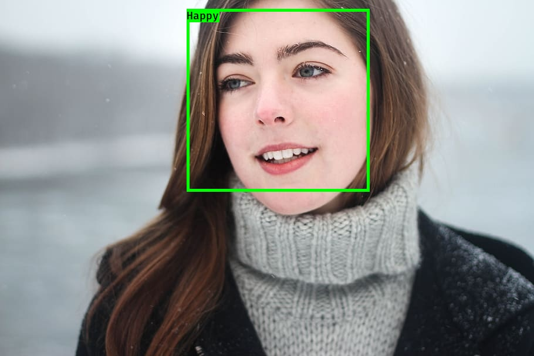
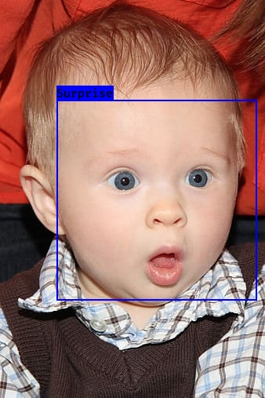
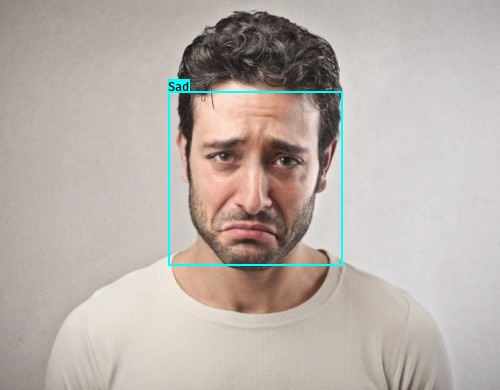

# Emotion-Detection
This software detects different emotions (like happy,sad,angry and so on) of human face in 
Realtime cam,Image and video.The model is trained using deep convolutional network on the 
FER-2013 dataset which was published on International Conference on Machine Learning (ICML). 

## Demo

